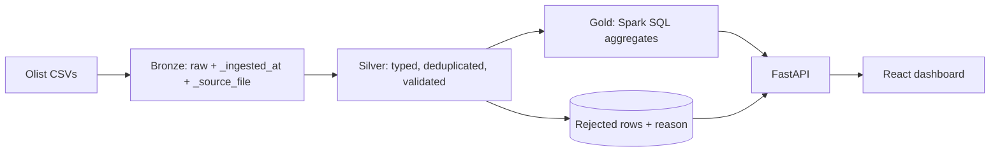
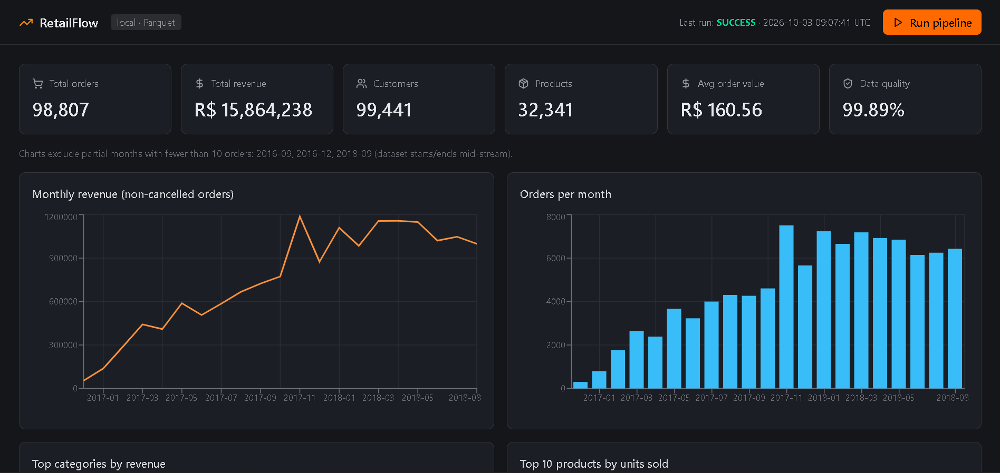
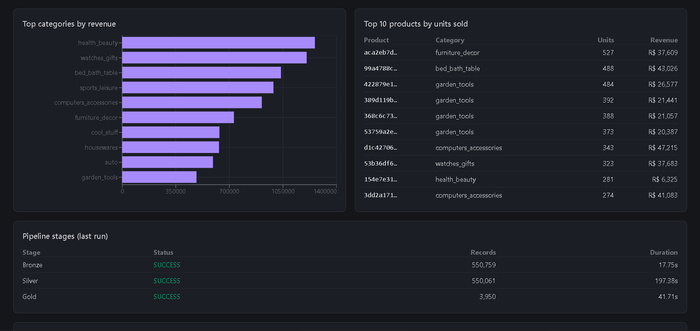
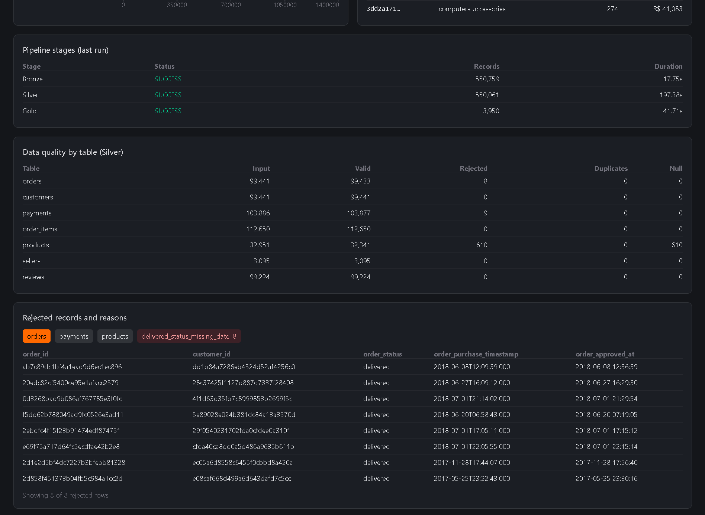

# RetailFlow: E-Commerce Data Engineering Platform

A Medallion-architecture (Bronze / Silver / Gold) ETL project on the public Olist Brazilian e-commerce dataset, implemented twice:

- **Local mode:** PySpark + Parquet, orchestrated by a FastAPI backend and shown in a React dashboard.
- **Databricks mode:** PySpark + Delta Lake notebooks (Free Edition, serverless), including a Delta `MERGE` and a watermark-based incremental load.

Both implementations were run on the real dataset and produce the same headline numbers (see [Results](#results)).

## Business problem
Raw marketplace exports (orders, items, payments, reviews, ...) arrive as separate CSVs with quality problems. Analysts need clean, trusted tables and business metrics, plus visibility into what was rejected and why.

## Objectives
Ingest raw CSVs without altering them, validate and clean them while keeping every rejected row with a reason, build analytics tables, and expose results through an API and dashboard.

## Technology stack
Python, PySpark (4.x), Spark SQL, Delta Lake (Databricks only), FastAPI, Pydantic, pandas/pyarrow (API reads), React + Vite, Tailwind CSS, Recharts, Lucide, pytest. No paid services or API keys.

## Architecture


| Mode | Storage | Where it runs |
|---|---|---|
| Local | Parquet files in `backend/storage/` | Your machine (needs Java) |
| Databricks | Delta tables in `workspace.retailflow` | Databricks Free Edition notebooks |

The dashboard and API read the **local** Parquet output only. The Databricks notebooks are a separate, standalone implementation.

## Medallion layers
- **Bronze:** CSVs read as strings (raw preserved) plus ingestion timestamp and source file name.
- **Silver:** type casting, de-duplication on business keys, validation rules. Invalid rows are written to `rejected/` with a `_reject_reason` column, never silently dropped.
- **Gold:** monthly revenue, daily sales, top products, category revenue, seller revenue, customers by state, order status, payment methods, review scores, KPIs.

**Revenue definition:** sum of valid payments on valid, non-cancelled orders.

## Data quality rules (Silver)
| Table | Rejected when |
|---|---|
| all | duplicate business key (keeps latest) |
| orders | null order/customer id; unparseable purchase timestamp; delivered before purchase; status `delivered` with no delivery date |
| payments | null order id; null/negative/zero value; type `not_defined` |
| order_items | null ids; null/negative price |
| products | null id; missing category |
| reviews | score null or outside 1-5 |
| customers, sellers | null key (customers: null state) |

Metrics per table: input, valid, rejected, duplicate and null record counts.

## Setup and run (Windows, VS Code)
Requirements: Python 3.10+, Java 17+ (Java 23 worked), Node.js LTS.

```powershell
python -m venv .venv
.venv\Scripts\activate
pip install -r backend\requirements.txt
```
Download the dataset from https://www.kaggle.com/datasets/olistbr/brazilian-ecommerce and copy the CSV files into `data\raw\` (the geolocation file is unused).

**Windows only:** Spark needs `winutils.exe` and `hadoop.dll` (Hadoop 3.3.x builds, e.g. from github.com/cdarlint/winutils) in `C:\hadoop\bin`, then:
```powershell
$env:HADOOP_HOME = "C:\hadoop"
$env:PATH = "C:\hadoop\bin;$env:PATH"
```
Run the pipeline, the API and the dashboard:
```powershell
python -m backend.pipeline.run
python -m uvicorn backend.app.main:app --reload     # terminal 1, API docs at http://127.0.0.1:8000/docs
cd frontend; npm install; npm run dev                # terminal 2, dashboard at http://localhost:5173
python -m pytest tests
```
The dashboard's **Run pipeline** button triggers the same pipeline through the API (set the `HADOOP_HOME` variables in the API's terminal first).

## Databricks (Free Edition)
1. Import `databricks/*.py` and `04_sql_analysis.sql` via **Workspace > Import**.
2. Run the first two cells of `01_bronze_ingestion` to create schema `workspace.retailflow` and volume `raw`.
3. **Catalog > workspace > retailflow > raw > Upload to this volume:** upload the 8 CSVs.
4. Run notebooks 01, 02, 03 (compute: Serverless), then 04.

Delta features: managed Delta tables, `MERGE` upsert (SCD Type 1) for `silver_orders`, watermark table for incremental loads, partitioned `gold_daily_sales`, `DESCRIBE HISTORY`.

## API
| Endpoint | Purpose |
|---|---|
| `GET /api/health` | liveness |
| `POST /api/pipeline/run` | start the pipeline in a background thread (409 if already running) |
| `GET /api/pipeline/status`, `/logs` | current state; persisted run history |
| `GET /api/dashboard/summary`, `/revenue-trend`, `/top-products`, `/category-revenue` | Gold data |
| `GET /api/data/quality` | Silver quality metrics |
| `GET /api/data/rejected?table=orders` | rejected rows with reason counts |

## Results
Measured on the full dataset (local run, one Windows machine; durations will vary):

| Metric | Value |
|---|---|
| Valid non-cancelled orders | 98,807 |
| Revenue | R$ 15,864,238 |
| Average order value | R$ 160.56 |
| Silver rejections | orders 8, payments 9, products 610 |
| Overall quality score | 99.89% (550,061 valid of 550,688 records, 7 tables) |
| Stage durations | Bronze 17.8 s, Silver 197.4 s, Gold 41.7 s |

The Databricks notebooks reproduced the same Bronze counts, rejection counts, order count, revenue and average order value. Re-running notebook 02 without new Bronze data processed 0 new orders and left `silver_orders` at 99,433 rows.

Observations: the dataset has no duplicate keys on the checked columns; it begins and ends with partial months (the dashboard excludes months with under 10 orders); 2016-11 has no data.

## Limitations
- Local mode uses Parquet, not Delta. Delta, MERGE and the watermark exist only in the Databricks notebooks.
- Incremental loading and MERGE apply to `orders` only. Bronze is overwritten each run, so the watermark mainly demonstrates idempotence. No SCD Type 2, CDC or streaming is implemented.
- Not built: Data Explorer, Pipeline Logs and Analytics pages, CSV download, light theme, and the endpoints `/api/data/layers`, `/api/data/preview`, `/api/analytics/*`.
- Tests: 10 pytest tests (quality rules, Bronze ingestion, Gold aggregation, API endpoints) on small synthetic fixtures. They check logic, not the full Olist run, and there are no Silver per-table tests or frontend tests.
- Single-machine local Spark; not production-scale.

## Future work
Remaining dashboard pages, more tests, a Delta-backed local mode, SCD Type 2 on a real changing dimension, data-quality alerting.

   ## Screenshots
   
   
   